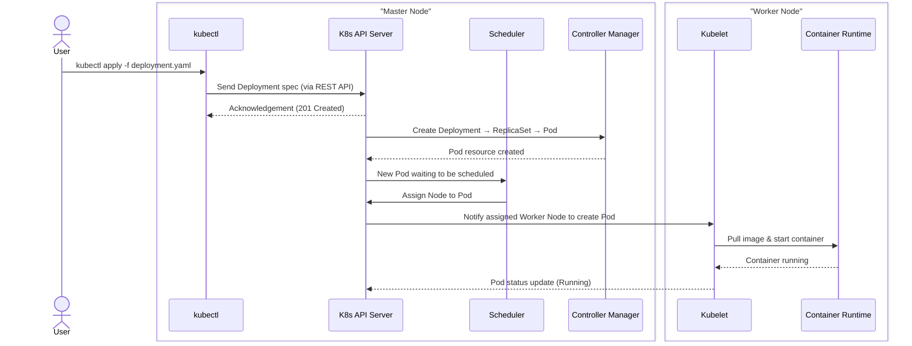

Kubernetes 容器管理平台工作坊
===

## Table of Contents

[TOC]

## 為何需要 Kubernetes
> coreOS的創辦人 Kelsey Hightower 說 : Kubernetes 是一個用來建置平台的平台

```gherkin=
https://www.opensourcerers.org/2021/12/06/kubernetes-is-a-platform-for-building-platforms/
```
### Kubernetes 的前身 BORG
> Kubernetes三位發明人Craig McLuckie, Joe Beda 與 Brendan Burns，時任Google研發部門，以Side Project 的形式，比照BORG的設計哲學研發出開源專案 Kubernetes

```gherkin=
https://research.google/pubs/large-scale-cluster-management-at-google-with-borg/
```
> BORG在電影星際爭霸戰中，可以用心智與大腦控制電子設備的外星種族；Google的Infrastructure 的管理核心，即以此為名


### K8s 基本架構


## Labs 環境準備
> 安裝 VirtualBox
https://www.virtualbox.org/wiki/Downloads

> 安裝 Vagrant
https://www.vagrantup.com/
Vagrant是一款用於構建及組態虛擬開發環境的軟體，採用Ruby編寫，主要以命令列方式執行。
其主要使用Oracle VirtualBox提供虛擬化系統，與Chef，Salt，Puppet等環境組態管理軟體搭配使用，可以實現快速搭建虛擬開發環境。

> 下載 Labs 設定
```gherkin=
git clone https://github.com/ChunPingWang/K8sLabs

cd K8sLabs/vagrant

# 下載虛擬機並啟動
vagrant up

# 啟動後登入虛擬機
vagrant ssh
```
> vagrant 簡易教學
```gherkin=
# 下列指令需在 ~/workspace/vagrant 下執行
cd ~/workspace/vargant

# 暫停虛擬機
vagrant suspend

# 啟動暫停的虛擬機
vagrant resume

# 刪除不使用的虛擬機
vagrant destroy
```

## Kind 基本操作


### 新增/刪除 K8s 叢集
```gherkin=
kind create cluster --name=k8s1

kind create cluster --name=k8s2

kind create cluster --name=k8s3

kind delete cluster --name=k8s3

```


### 多K8s叢集操作
```gherkin=
# 列出所有叢集
kubectl config get-contexts

# 切換叢集
kubectl config use-context k8s1

```


### 建立多工作節點叢集 K8s

```gherkin=
cd ~/workspace/kind
```
> 建立多節點 K8s(將下列內容儲存於 m-nodes.yaml)
```gherkin=
# three node (two workers) cluster config
kind: Cluster
apiVersion: kind.x-k8s.io/v1alpha4
nodes:
- role: control-plane
- role: worker
- role: worker
- role: worker
```

```gherkin=
# 執行下列指令，建立多節點叢集
kind create cluster --name=m-nodes --config=m-nodes.yaml

kubectl get nodes
```


```gherkin=
# 查看 worker3 節點的詳細資訊
kubectl describe nodes m-nodes-worker3
```


> 參考資料
```
https://kind.sigs.k8s.io/
```
## Kubernetes 基本操作
### 平台相關操作
> 查看叢集狀態
```gherkin=
kubectl get all 
```
### namespace 相關操作
> 顯示全部 namespace
```gherkin=
kubectl get namespace
```
> 建立 namespace
```gherkin=
kubectl create namespace myns
```
>刪除 namespace
```gherkin=
kubectl delete namespace myns
```
> 設定預設 namespace
```gherkin=
kubectl config use-context kind-k8s1

kubectl create ns n1

kubectl create ns n2

kubectl create ns n3

# 列出全部 namespace
kubectl get ns

# 將 叢集 kind-k8s1 的 namespace n3 設定成預設 namespace
kubectl config set-context kind-k8s1 --namespace=n3

kubectl get pods
```

### Pod 相關操作
> 甚麼是 Pod?
> 1. K8s中最小的操作單元
> 2. 一個 Pod 可以部署一個或一個以上容器
> 3. 通常一個 Pod 只部署一個容器

> 4. 部署一個Pod的循序圖



> 方法1. 以指令直接部署鏡像 nginx 至pod
```gherkin=
kubectl run nginx --image=nginx --restart=Never
```
> 查看全部 pod
```gherkin=
kubectl get pods

kubectl get pod

kubectl get po
```
> 查看單一個 pod
```gherkin=
kubectl get pod nginx
```
> 匯出 pod 安裝腳本以 YAML 呈現
```gherkin=
kubectl get pod nginx -o yaml > pod-export-nginx.yaml

cat pod-export-nginx.yaml

```


> 刪除 pod
```gherkin=
kubectl delete pod nginx
```

> 先產生 pod 的 yaml檔，再部署
```gherkin=

kubectl get pod 

kubectl run nginx --image=nginx --dry-run=client --restart=Never -o yaml > pod-nginx.yaml

cat pod-nginx.yaml

kubectl apply -f pod-nginx.yaml

kubectl get pod
```

```gherkin=
kubectl describe pod nginx
```
> 可觀察到 Pod 的實際 IP


```gherkin=
# 取得 pod 名稱後，刪除 pod
kubectl get pods

kubectl delete pod nginx
```
> 同一個 pod 裡面部署兩個容器
> 1.兩個容器共用 pod 的 ip
> 2.一個 pod 相當於一台 VM
> 3.兩個 pod 以 localhost 互相呼叫
```gherkin=
kubectl run nginx --image=nginx --dry-run=client --restart=Never -o yaml > pod-nginx-busybox.yaml
```
> 編輯 pod-nginx-busybox.yaml
> 在 containers 中


> 加入
```
 - args:
    - /bin/sh
    - -c
    - echo hello;sleep 3600
    image: busybox
    name: busybox
```
> 結果如下(檔案位於 ~/workspace/k8s/pod/pod-nginx-busybox.yaml):


> 部署兩顆容器的 pod，並登入取得 Nginx 首頁資訊
```gherkin=
#部署兩個容器的一個pod
kubectl apply -f pod-nginx-busybox.yaml

#以 -c 指定要登入到 busybox上的容器
kubectl exec -it nginx -c busybox -- /bin/sh

#以 wget 呼叫 nginx 內建的首頁
wget localhost
#以此證明同一個 Pod 裡的不同容器，使用同一個 IP Address，意即一個Pod相當一個台電腦或是VM
```
> 取得結果如下


```gherkin=
kubectl describe po nginx
```
> 可觀察到Pod Nginx 裡有兩個容器，一個為 Nginx一個為 BusyBox


> 可觀察到Pod Nginx 裡有兩個容器的啟動 Event


```gherkin=
kubectl delete po nginx
```

### Deployment 相關操作
> Deployment 概念
> 1. 通常以一個 Deployment 部署一個應用/微服務的方式建置
> 2. 一個 Deployment可部署同一顆容器多份Pod的replica，以滿足應用/微服務高可用需求
> 先產生 deployment 的 yaml 檔，再部署
```gherkin=

cd ~/workspace/deploy

kubectl get deploy -A

kubectl get pod -A

kubectl create deploy deploy-nginx --image=nginx --dry-run=client -o yaml > deploy-nginx.yaml

kubectl apply -f deploy-nginx.yaml

kubectl get deploy 

kubectl get pods

kubectl delete pod nginxxxx # 查詢到的 pod 名稱 

# 觀察 Pod 會自動治癒，恢復原來的數量
kubectl get pod
```

> 調整 deployment 中的 pod 數量
> 方法 1.
```
# 修改線上正在執行的 pod 數量

kubectl edit deploy deploy-nginx

# 找到 replic 

```


> 方法 2.
```
vim deploy-nginx.yaml
或用 
VS Code
```


```gherkin=
#再 apply 一次
kubectl apply -f deploy-nginx.yaml

kubectl get deploy
```


```gherkin=
kubectl get po
```


```
kubectl delete pod nginxxxx # 查詢到的 pod 名稱 

# 觀察 Pod 會自動治癒，恢復原來的數量，且會使用不一樣的名稱
kubectl get pod
```


```gherkin=
kubectl delete deploy deploy-nginx 
```

> 部署 nginx deployment 到 namespae 
```gherkin=

kubectl create namespace myns --dry-run=client -o yaml > myns.yaml # namespace 也可以用 ns

kubectl apply -f myns.yaml

kubectl create deploy nginx --image=nginx -n myns --dry-run=client -o yaml > ns-nginx.yaml

cat ns-nginx.yaml

kubectl apply -f ns-nginx.yaml
```


```gherkin=
kubectl delete deploy nginx -n myns
```


### Job 

```gherkin=
kubectl create job job-busybox --image=busybox --dry-run=client -o yaml -- /bin/sh -c 'echo hello;sleep 60;echo world'  > job-busybox.yaml

kubectl apply -f job-busybox.yaml

kubectl get jobs

kubectl get pods

kubectl logs job-busybox-lrpjh

kubectl describe pod job-busybox-lrpjh

kubectl delete job job-busybox

kubectl get jobs

kubectl get pods
```


> 等待 Job 完成的兩種指令
```gherkin=

kubectl get jobs -w

# 等到狀態為 complete 
kubectl wait --for=condition=complete --timeout=300s job job-busybox
 
```


```gherkin=
# 刪除 Job
kubectl delete job job-busybox
```

#### Job 執行超過設定時間，K8s自動停止該 Job

> 用busybox，新增一個 Job，並加入第9行 activeDeadlineSeconds:，指定秒數
```gherkin=
apiVersion: batch/v1
kind: Job
metadata:
  creationTimestamp: null
  labels:
    run: busybox
  name: job-deadline-busybox
spec:
  activeDeadlineSeconds: 30 # 代表超過 30 後，K8s會自行終止該 Job
  template:
    metadata:
      creationTimestamp: null
      labels:
        run: busybox
    spec:
      containers:
      - args:
        - /bin/sh
        - -c
        - while true; do echo hello; sleep 10;done
        image: busybox
        name: busybox
        resources: {}
      restartPolicy: OnFailure
status: {}
```

```gherkin=
kubectl get job
 
# Deadline Job 會以 Fail 方式結束，這個指令等不到 complete 狀態 
kubectl wait --for=condition=complete --timeout=300s job job-deadline-busybox
```


#### 重複執行多次 Job
> 用busybox，新增一個 Job，並加入第9行 completions: ，指定次數
```gherkin=
apiVersion: batch/v1
kind: Job
metadata:
  creationTimestamp: null
  labels:
    run: busybox
  name: job-completions-busybox
spec:
  completions: 5 # add this line
  template:
    metadata:
      creationTimestamp: null
      labels:
        run: busybox
    spec:
      containers:
      - args:
        - /bin/sh
        - -c
        - echo hello;sleep 10;echo world
        image: busybox
        name: busybox
        resources: {}
      restartPolicy: OnFailure
status: {}
```

```gherkin=
kubectl apply -f job-completions-busybox.yaml

kubectl get job job-completions-busybox -w
```


#### 平行執行多個 Job
> 用busybox，新增一個 Job，並加入第9行 parallelism:，指定平行執行Job數量

```gherkin=
apiVersion: batch/v1
kind: Job
metadata:
  creationTimestamp: null
  labels:
    run: busybox
  name: job-paralle-busybox
spec:
  parallelism: 5 # add this line
  template:
    metadata:
      creationTimestamp: null
      labels:
        run: busybox
    spec:
      containers:
      - args:
        - /bin/sh
        - -c
        - echo hello;sleep 30;echo world
        image: busybox
        name: busybox
        resources: {}
      restartPolicy: OnFailure
status: {}
```

```gherkin=

kubectl apply -f job-paralle-busybox.yaml

kubectl get jobs

kubectl get pods
```


```gherkin=

# 刪除 Job ，會將相關 Pod 一併刪除
kubectl delete job job-paralle-busybox

kubectl get pods 
```


### CronJob 
```gherkin=
kubectl create cronjob cj-busybox --image=busybox --schedule="*/1 * * * *" --dry-run=client -o yaml -- /bin/sh -c 'date; echo Hello World' > cj-busybox.yaml
```
> cj-busybox.yaml 內容如下
```gherkin=
apiVersion: batch/v1
kind: CronJob
metadata:
  creationTimestamp: null
  name: cj-busybox
spec:
  jobTemplate:
    metadata:
      creationTimestamp: null
      name: cj-busybox
    spec:
      template:
        metadata:
          creationTimestamp: null
        spec:
          containers:
          - command:
            - /bin/sh
            - -c
            - date; echo Hello World
            image: busybox
            name: cj-busybox
            resources: {}
          restartPolicy: OnFailure
  schedule: '*/1 * * * *'
status: {}
```
```gherkin=
kubectl apply -f cj-busybox.yaml

kubectl get cj

kubectl get jobs

kubectl get po
```


```gherkin=
kubectl logs cj-busybox-28862832-zvpjx

kubectl delete cj cj-busybox 
```


```gherkin=
kubectl get cj

kubectl create job --from=cronjob/cj-busybox job-from-cj-busybox

kubectl get jobs

kubectl get pods

kubectl logs job-from-cj-busybox-clcp8
```


### Service與網路
#### Port Forward
```gherkin=

kubectl run portforward-nginx --image=nginx 

kubectl port-forward portforward-nginx 8888:80 

# 開啟瀏覽器，URL 輸入 localhost:8888
# 結束，在 Command Line 使用 CTRL + C 
```


#### Service Type
> ClusterIP
1. 預設的 service type
2. 外部無法呼叫
3. 用來作為K8s內部服務互相呼叫的配置
> NodePort
1. 會以K8s的worker node上的port提供外部呼叫
2. 但不鼓勵這樣做
> LoadBalancer
1. 需要有額外組件
2. 可參考 https://kind.sigs.k8s.io/docs/user/loadbalancer/

> debug 技巧
將下列 yaml 儲存成 dnsutls.yaml(檔案位於 ~/workspace/k8s/service/dnsutils.yaml)
```gherkin=
apiVersion: v1
kind: Pod
metadata:
  name: dnsutils
  namespace: default
spec:
  containers:
  - name: dnsutils
    image: registry.k8s.io/e2e-test-images/agnhost:2.39
    imagePullPolicy: IfNotPresent
  restartPolicy: Always
```
部署 dnsutils.yaml
```
cd ~/workspace/k8s/service

kubectl apply -f dnsutils.yaml
```
查看 FQDN
```
kubectl exec -i -t dnsutils -- nslookup kubernetes.default
```

> 以下列指令模擬應用部署
```gherkin=
kubectl run nginx --image=nginx --restart=Never --port=80 --expose  --dry-run=client -o yaml > svc-pod-nginx.yaml
```
> 得到兩個部分
```
apiVersion: v1
kind: Pod
metadata:
  creationTimestamp: null
  labels:
    run: ci-nginx
  name: ci-nginx
spec:
  containers:
  - image: nginx
    name: nginx
    ports:
    - containerPort: 80
    resources: {}
  dnsPolicy: ClusterFirst
  restartPolicy: Never
status: {}
```
```
apiVersion: v1
kind: Service
metadata:
  creationTimestamp: null
  name: ci-nginx
spec:
  ports:
  - port: 80
    protocol: TCP
    targetPort: 80
  selector:
    run: ci-nginx
status:
  loadBalancer: {}
```
> 執行部署
```
kubectl apply -f svc-pod-nginx.yaml
```
> 查看結果
```
kubectl get svc nginx # services
```

```
kubectl get ep # endpoints
```


```
kubectl get svc nginx # 取得 Nginx 的 Service IP

# 驗證可以透過 Cluster IP取得 Nginx 的 IP
kubectl run busybox --rm --image=busybox -it --restart=Never -- /bin/sh
# 登入 busybox 後執行 wget 指令，取得 Nginx 首頁
#下列指令須執行於 busybox的 shell
wget -O- [改成Nginx的Service IP]:80
```


```gherkin
# 登出 busybox，並刪除 busybox
#下列指令須執行於 busybox的 shell
exit
```


觀察點:
1. --rm : 代表執行完指令，busybox 自動被刪除
2. wget 會下載 nginx 的首頁

### ConfigMap
#### 建立方法 1.(literal)
```gherkin=
kubectl create configmap cmliteral --from-literal=fisrtname=rex --from-literal=lastname=wang
```


#### 建立方法 2.(file)
```gherkin=
# 產出 key-value 的資料檔
# 位於 ~/workspace/k8s/configmap

cd ~/workspace/k8s/configmap

echo -e "first=Ada\nlastname=Hsu" > cmfromfile.txt
```


```gherkin=

kubectl create cm cmfile --from-file=cmfromfile.txt

kubectl get configmap

kubectl get cm
```


```gherkin=
k get cm cmfile -o yaml
```


#### 建立方法 3.
```gherkin=
# 產出環境變數檔
# 位於 ~/workspace/k8s/configmap
echo -e "var1=val1\n# this is a comment\n\nvar2=val2\n#anothercomment" > config.env

kubectl create configmap cmenv --from-env-file=config.env --dry-run=client -o yaml > cmenv.yaml

kubectl apply -f cmenv.yaml
```


```gherkin=
kubectl describe cm cmenv
```


```gherkin=
kubectl run cmenv-nginx --image=nginx --restart=Never --dry-run=client -o yaml > cm-nginx-pod.yaml
vi cm-nginx-pod.yaml
```
> 編輯pod yaml 
```gherkin=
apiVersion: v1
kind: Pod
metadata:
  creationTimestamp: null
  labels:
    run: nginx
  name: nginx
spec:
  containers:
  - image: nginx
    imagePullPolicy: IfNotPresent
    name: nginx
    resources: {} # 加入env:之後
        env:
        - name: option # 環境變數名稱
          valueFrom:
            configMapKeyRef:
              name: cmenv # configMap 名稱
              key: var1 # name of the entity 
  dnsPolicy: ClusterFirst
  restartPolicy: Never
status: {}
```

```gherkin=
kubectl apply -f cm-nginx-pod.yaml
```


> 登入 Pod cmenv-nginx
```
kubectl exec -it cmenv-nginx -- /bin/bash
```

```gherkin=
# 下列指令，請在容器裡執行
# 查看變數 option 是否已被指定值為 val1
echo $option # option 設定於 pod 的 yaml 
```


```gherkin=
# 下列指令，請在容器裡執行
# 列出環境變數
env
```


```gherkin=
# 下列指令，請在容器裡執行
# 離開 Pod 的 Shell
exit
```
### Secret
#### 建立方法 1.
```gherkin=
cd ~/workspace/k8s/secret 

kubectl create secret generic secretliteral --from-literal=password=mypass

# 或是
kubectl create secret generic sec-literal --dry-run=client --from-literal=password=mypass -o yaml > sec-literal.yaml

kubectl apply -f sec-literal.yaml

kubectl get secret
```


#### 建立方法 2.
```gherkin=
echo -n admin > username

kubectl create secret generic sec-file --from-file=username

kubectl get secret sec-file -o yaml

echo -n YWRtaW4= | base64 -d # 顯示 amdin

# 還可以用這個方式還原
kubectl get secret sec-file -o jsonpath='{.data.username}' | base64 -d  # 顯示 amdin

# 還可以用這個方式還原
kubectl get secret sec-file -o jsonpath='{.data.username}' | base64 -d  # 顯示 amdin

# 還可以用這個方式還原
kubectl get secret sec-file --template '{{.data.username}}' | base64 -d  # 顯示 amdin

# 還可以用這個方式還原
kubectl get secret sec-file -o json | jq -r .data.username | base64 -d  # 顯示 amdin ，在此證明 K8s Secret並不安全，需使用其他工具加密
```


#### 使用方法 1.
```gherkin=
# 產出 Pod 部署檔 sec-file-nginx-pod.yaml
kubectl run sec-file-nginx --image=nginx --restart=Never -o yaml --dry-run=client > sec-file-pod-nginx.yaml

vim sec-file-pod-nginx.yaml
```
> 編輯 Pod 部署檔 sec-file-pod-nginx.yaml 的內容
```gherkin=
apiVersion: v1
kind: Pod
metadata:
  creationTimestamp: null
  labels:
    run: sec-file-nginx
  name: sec-file-nginx
spec:
  volumes: # specify the volumes
  - name: mysecret # 在 containers 段落的 volumneMounts 段落的名稱，也就是容器認定的secret名稱
    secret: #
      secretName: sec-file # 前面建立的 secret
  containers:
  - image: nginx
    name: sec-file-nginx
    resources: {}
    volumeMounts: # 以 volumne 的方式使用 secret
    - name: mysecret # 容器認定的secret名稱
      mountPath: /etc/mysecret # 掛載路徑
  dnsPolicy: ClusterFirst
  restartPolicy: Never
status: {}
```
```gherkin=
kubectl apply -f sec-file-pod-nginx.yaml

# 確認 secret-file-nginx 是否部署成功
kubectl describe po sec-file-nginx 
```


```gherkin=
# 查看 secret

kubectl exec -it sec-file-nginx -- ls /etc/mysecret

kubectl exec -it sec-file-nginx -- ls /etc/mysecret/username

kubectl exec -it sec-file-nginx -- cat /etc/mysecret/username
```


```gherkin=
# 也可以使用下列步驟
# 確定成功後登入容器內
kubectl exec -it sec-file-nginx -- /bin/bash

# 在容器中的 BASH 執行
ls /etc/mysecret  # shows username
# 在容器中的 BASH 執行
cat /etc/mysecret/username # shows admin
```


#### 使用方法 2.
```gherkin=
kubectl run sec-env-nginx --image=nginx --restart=Never -o yaml --dry-run=client > sec-env-pod-nginx.yaml

vim sec-env-pod-nginx.yaml
```
> 編輯 secret-env-nginx-pod.yaml，以env的方式提供POD使用

```gherkin=
apiVersion: v1
kind: Pod
metadata:
  creationTimestamp: null
  labels:
    run: sec-env-nginx
  name: sec-env-nginx
spec:
  containers:
  - image: nginx
    name: sec-env-nginx
    resources: {}
    env: # 表示以環境變數提供
    - name: USERNAME # 以 USERNAME 作為環境變數的 key
      valueFrom:
        secretKeyRef: # secret reference
          name: sec-file # 之前建立的 filesecret
          key: username # 建立 filesecrect 時使用的 key 
  dnsPolicy: ClusterFirst
  restartPolicy: Never
status: {}
```
> 驗證
```
kubectl apply -f sec-env-nginx-pod.yaml

kubectl exec -it sec-env-nginx -- /bin/bash

# 在容器中的 BASH 執行
env
# 在容器中的 BASH 執行
echo $USERNAME # 得到 sec-file 設定的內容 admin

```


### PV/PVC
#### 同一個 Pod 中的兩個容器，共用資料，使用  emptyDir

```gherkin=
kubectl run busybox --image=busybox --restart=Never -o yaml --dry-run=client -- /bin/sh -c 'sleep 3600' > emptyDir-pod-busybox.yaml
vi emptyDir-pod-busybox.yaml
```
> 編輯修改內容如下
```gherkin=
apiVersion: v1
kind: Pod
metadata:
  creationTimestamp: null
  labels:
    run: busybox
  name: busybox
spec:
  containers:
  - args:
    - /bin/sh
    - -c
    - sleep 3600
    image: busybox
    name: producer
    resources: {}
    volumeMounts: #
    - name: sharedvolume # 使用下面 Volumes 的 sharedvolume
      mountPath: /etc/putting # 掛載到 /etc/putting
  - args:
    - /bin/sh
    - -c
    - sleep 3600
    image: busybox
    name: consumer # !
    volumeMounts: #
    - name: sharedvolume # 使用下面 Volumes 的 sharedvolume
      mountPath: /etc/getting # 掛載到 /etc/getting
  volumes: #
  - name: sharedvolume #
    emptyDir: {} #
  dnsPolicy: ClusterFirst
  restartPolicy: Never
status: {}
```
> 觀察點:
> 1. 第29-31行: volumes 名為 sharedvolume，volume的型態為 emptyDir 
> 2. volumes段落的設定，代表要在 Pod 裡面分享檔案空間 


```gherkin=
kubectl apply -f emptyDir-pod-busybox.yaml
```
> 驗證
```gherkin=
kubectl exec -it busybox -c producer -- /bin/sh

# 在 producer 下執行下列指令
echo "Greeting From Producer" > /etc/putting/file
# 確定內容
cat /etc/putting/file
```


```gherkin=
kubectl exec -it busybox -c consumer -- /bin/sh

# 在 consumer 下執行下列指令
ls -al /etc/getting/
# 確定內容
cat /etc/getting/file # 取得內容應為 Greeting From Producer
```


#### 建立一個 10G 的空間

```gherkin=
 vim pv-10g.yaml
```
```gherkin=
kind: PersistentVolume
apiVersion: v1
metadata:
  name: pv-10g
spec:
  storageClassName: normal
  capacity:
    storage: 10Gi
  accessModes:
    - ReadWriteOnce
    - ReadWriteMany
  hostPath:
    path: /etc/foo
```

```gherkin=
kubectl get pv
```

#### 取用一個 4G 的PVC

```gherkin=
vim pvc-4g.yaml
```


```gherkin=
kind: PersistentVolumeClaim
apiVersion: v1
metadata:
  name: pvc-4g
spec:
  storageClassName: normal
  accessModes:
    - ReadWriteOnce
  resources:
    requests:
      storage: 4Gi
```

```gherkin=
kubectl get pvc

kubectl get pv
```

> 觀察點 : PVC pvc-4g使用了PV pv10

> 使用 PV/PVC
> 建立一個 Pod
```gherkin=
kubectl run pvc-pod-busybox --image=busybox --restart=Never -o yaml --dry-run=client -- /bin/sh -c 'sleep 3600' > pvc-pod-busybox.yaml
```
> 編輯 
```gherkin=
vim pvc-pod-busybox.yaml
```
> 加入volumes與volumeMounts

```gherkin=
apiVersion: v1
kind: Pod
metadata:
  creationTimestamp: null
  labels:
    run: pvc-pod-busybox
  name: pvc-pod-busybox
spec:
  containers:
  - args:
    - /bin/sh
    - -c
    - sleep 3600
    image: busybox
    name: pvc-pod-busybox
    resources: {}
    volumeMounts: #
    - name: pvc-4g-in-pod # 定義在 volumes 的名稱
      mountPath: /etc/pvc-4g # Pod 裡的 Linux 的掛載點
  dnsPolicy: ClusterFirst
  restartPolicy: Never
  volumes: #
  - name: pvc-4g-in-pod # volume 在 Pod 的名稱
    persistentVolumeClaim: #
      claimName: pvc-4g # PVC 的名稱
status: {}
```

```gherkin=
kubectl exec -it pvc-pod-busybox -- /bin/sh

# 在 Pod 裡面執行下列指令,新增並查看檔案內容
ls -al /etc/pvc-4g

echo "File from busybox" > /etc/pvc-4g/file

cat /etc/pvc-4g/file
```


```gherkin=

cp pvc-pod-busybox.yaml pvc-pod-checkbusybox.yaml
# vim pvc-pod-checkbusybox.yaml
# 修改 metadata.name: pvc-pod-busybox 成為 pvc-pod-checkbusybox
# 存檔後離開
# 兩個 Pod 的差別只有名稱
```


```gherkin=
kubectl apply -f pvc-pod-checkbusybox.yaml

kubectl exec -it pvc-pod-busybox -- /bin/sh

# 在 Pod 裡面執行指令,查看檔案內容
cat /etc/pvc-4g/file # 在checkbusybox得到與busybox同一個檔案
```


#### 從容器中複製檔案到外面作業系統，使用 kubectl cp 指令

```gherkin=
# 建立一個Pod，名為 cp-cmd-busybox 的 busybox
kubectl run cp-cmd-busybox --image=busybox --restart=Never -- sleep 3600
# 將 /etc/passwd 複製到外部作業系統的當前路徑
kubectl cp cp-cmd-busybox:/etc/passwd ./passwd

ls -al passwd

mv passwd passwdxxx

# 將改過名稱的檔案複製到 /etc/tmp
kubectl cp passwdxxx cp-cmd-busybox:/etc/tmp
```


> 比對兩個檔案內容
```gherkin=

kubectl exec cp-cmd-busybox -- cat /etc/passwd

kubectl exec cp-cmd-busybox -- cat /etc/tmp
```


## Appendix and FAQ

:::info
**Find this document incomplete?** Leave a comment!
:::

###### tags: `Templates` `Documentation`
